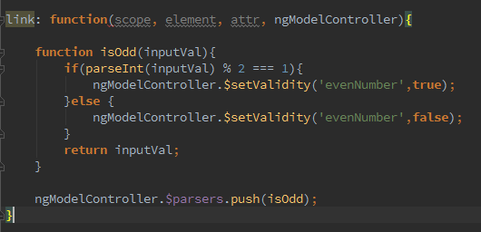
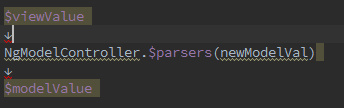
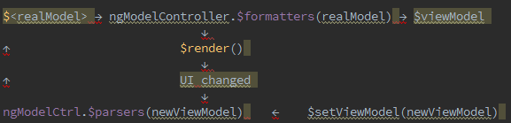
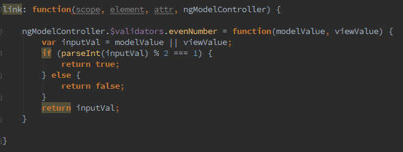

Title: All about angularjs $formatters and $parsers
Date: 2018-04-24 15:29:13

[The original link](https://www.linkedin.com/pulse/all-angularjs-formatters-parsers-anuradha-bandara?trk=pulse-wechat-qr)

Hi folks, As a front end developers we need to deal with different data models which come from the server side. We have to format them , change them and yes! we need to validate them. Mainly JSON at these days. In most cases back end data not in the way it should be.(Back end developers doesn't bother to format data that much).Hence we are in a dark when we are going to render that data in our view. If you are angularjs user, Hell! you are in the business. Fortunately angularjs developers thought about it and provide few powerful features to us. **Formatters**, **Parsers** , **validators** and **asyncValidators**.

<!-- more -->

Before going further , These four features we can access via “link” function within the directive. And another point is we need “**ngModelController**” instance for the access these features. $parsers and $formatters are arrays, that act as pipelines that get called when users update the view(View to model update) or app update the view(*Model to view update*).

So lets get to the business.A simple directive will explain everything. Lets start with the basic syntax of the $parsers and $formatters.

We can use “ModelController.$formatters.unshift()” or “ModelController.$formatters.push()” to bind our $formatter or $parser functions to our model controller.Here I used the second option.

So in here **scope** is the scope that is bound to our HTML template, **element** is the actual HTML DOM element, **attr** are the attributes of the directive HTML, and  **ngModelController**  is an instance of the required NgModelController.

Wait! I know you wonder what is this “require: 'ngModel'” statement do. Do not panic guys. This statement connects our ngModelController instance with the real ng-model directive.

The Important thing is this $parsers are called as soon as the value in the form input is modified by the user. In other words View to model update.In most of the cases $parsers used to handle custom validations. As an example, lets check this sample $parser function.

Lets see actually what happens in here.

As you can see , This simple parser function sets the validation attribute of our input. Pretty simple! That's about $parsers folks. Then we talk about $formatters.

$formatters do the opposite of $parsers.They deal with data coming up from the model into view and they will call whenever the model is changed.

Here is the super simple sample. This formatter convert input string into Uppercase.

Now its time to get these things together.This is the full cycle.

Now we know about parsers and formatters.But the story still continues.Angular 1.3 introduced new feature call validator.What the heck.we use parsers to validate.Why this new validator?Let me explain,

Validators are created by combining both parsers and formatters.Is this make sense to you?Yes that means, validators can access both view value and model value.Ok here is the same example of, we use earlier with $parsers.

Thing is we don't want to set validity in here. It will happen internally.

So far so good!Here is the final phase. What happens if you want to validate something based on server response. As an example you want to validate user name in your login. For these purposes we can use **$asyncValidators.Basically** these validators are based on promises. Lets go for the code. Sorry folks , I don't have any backend to demonstrate this. But here is the code. Go and try it yourself.

To see working example , go and pick jsfiddle that I created [here](http://jsfiddle.net/bandara00007/8xmLa22n/16/).

Cheers!Happy $parsers and $formatters!

