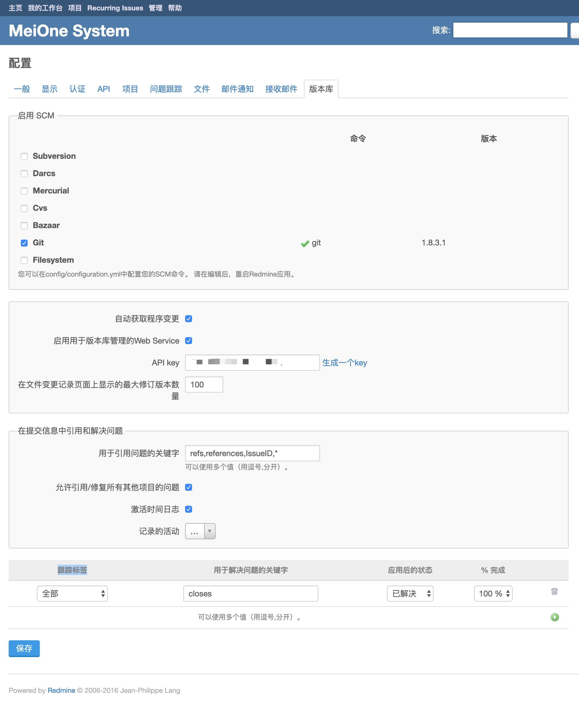
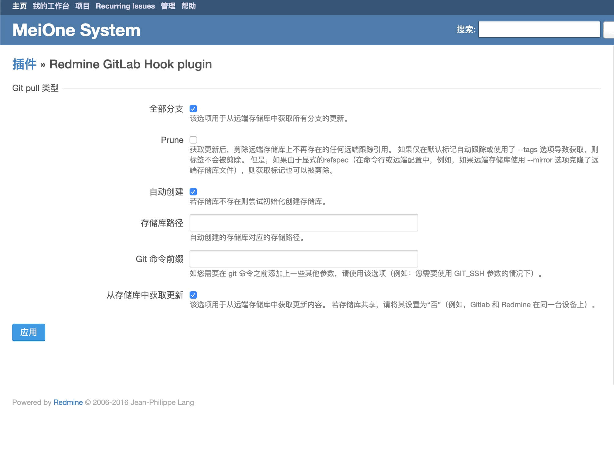
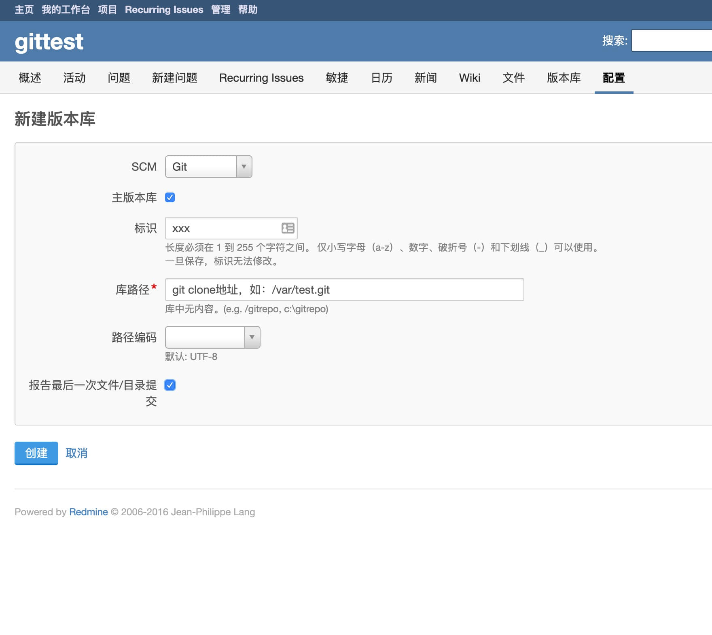

Title: redmine关联gitlab
Date: 2022-03-02 14:23:22

#### 1. 安装redmine_gitlab_hook
1. 下载：https://github.com/phlegx/redmine_gitlab_hook/releases
2. 解压后文件夹名字修改为redmine_gitlab_hook
3. 放到redmine安装目录的plugins文件夹下
4. 重启redmine

#### 2. 插件设置
1. 打开redmine的管理 - 配置 - 版本库
2. 选择SCM - git
3. 勾选自动获取程序变更、启用用于版本库管理的Web Service
4. 点击生成一个key
5. 修改用于引用问题的关键字添加\*号（用于捕获所有提交内容）：`refs,references,IssueID,*`
6. 跟踪标签可以设置关键字对应的状态和进度
7. 提交记录格式说明 https://www.redmine.org/projects/redmine/wiki/RedmineSettings#Referencing-issues-in-commit-messages

<!-- more -->

#### 3. 项目设置
1. `git clone --mirror git@xxx/xxx.git` 到redmine服务器文件夹
2. 打开redmine项目配置 - 版本库 - 新建版本库
3. 勾选主板本库，库路径为git clone文件夹
4. git项目settings/integrations添加webhook，url： `{redmine地址}/gitlab_hook?key={生成的key}&project_id={redmine项目标识}&repository_name={redmine版本库标识}`

