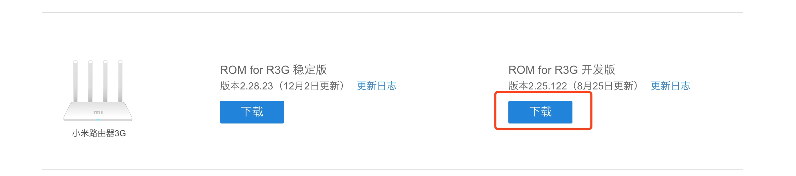
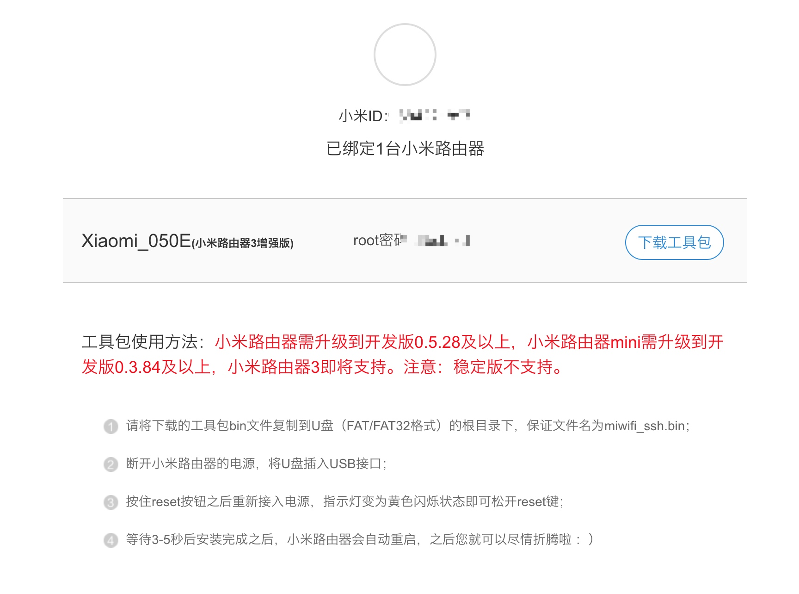

Title: 小米路由3G刷老毛子
Date: 2019-01-13 19:36:57

准备：

- 小米路由3G
- Windows或Mac电脑网线连接路由
- U盘（FAT/FAT32格式）

注：
> 使用网线连接路由后进行操作
> 不保证内容的正确性，不承担带来的风险和后果

<!-- more -->

### 一、刷开发版ROM

- 下载地址：[http://www1.miwifi.com/miwifi_download.html](http://www1.miwifi.com/miwifi_download.html)

- 打开[192.168.31.1](192.168.31.1)
- 升级固件，选择刚刚下载的文件

### 二、刷SSH

- 下载地址及方法(需登录绑定路由)：[https://d.miwifi.com/rom/ssh](https://d.miwifi.com/rom/ssh)

> 
- 请将下载的工具包bin文件复制到U盘（FAT/FAT32格式）的根目录下，保证文件名为miwifi_ssh.bin；
- 断开小米路由器的电源，将U盘插入USB接口；
- 按住reset按钮之后重新接入电源，指示灯变为黄色闪烁状态即可松开reset键；
- 等待3-5秒后安装完成之后，小米路由器会自动重启，之后您就可以尽情折腾啦 ：）

### 三、刷breed

注：Windows电脑需要安装xshell，MAC直接使用终端

- 输入: `ssh root@192.168.31.1` 回车
- 输入步骤二的root密码，回车
- 输入: `wget https://breed.hackpascal.net/breed-mt7621-xiaomi-r3g.bin` 回车
- 输入: `mtd write breed-mt7621-xiaomi-r3g.bin u-boot` 回车
- 断开小米路由器的电源，按住reset按钮之后重新接入电源，指示灯闪烁三次后松开
- 打开[192.168.1.1](192.168.1.1)

### 四、刷固件

- 下载固件：[http://opt.cn2qq.com/padavan/MI-R3G_3.4.3.9-099.trx](http://opt.cn2qq.com/padavan/MI-R3G_3.4.3.9-099.trx)
- 也可以打开[http://opt.cn2qq.com/padavan/](http://opt.cn2qq.com/padavan/)选择对应固件`MI-R3G_3.4.3.9-099.trx`下载
- 固件更新 - 固件-选择文件 - 上传
- 完成后打开[192.168.123.1](192.168.123.1)进行配置

参考来源：

[http://rt.cn2k.net/?p=85](http://rt.cn2k.net/?p=85)
[https://zhuanlan.zhihu.com/p/38705188](https://zhuanlan.zhihu.com/p/38705188)
[https://www.right.com.cn/forum/thread-161906-1-1.html](https://www.right.com.cn/forum/thread-161906-1-1.html)