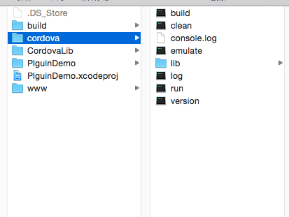

Title: 编写PhoneGapiOS插件一
Date: 2019-09-04 14:27:55

#PhoneGap安装

当前版本是`PhoneGap2.9.1`、`Xcode6.3`

1. 下载PhoneGap

	[官网地址](https://phonegap.com/install/)，NodeJS命令安装老是失败，我是直接下载的zip包解压的。
	

<!-- more -->

2. 解压

	解压之后的目录是这样的：
	

<!--more-->
#iOS的工程创建

1. 创建工程（终端命令）

	- 首先先建一个文件夹
	- 然后`cd /Users/admin/Downloads/phonegap-2.9.1/lib/ios/bin`
	- 创建`./create /Users/admin/Desktop/PlguinDemo com.xxxx.plguin PlguinDemo`

2. 说明

	- `/Users/admin/Desktop/PlguinDemo`为第一步创建的文件夹目录
	- `com.xxxx.plguin`为项目的`Bundle identifier`
	- `PlguinDemo`为项目的包名
	
3. 创建成功

	成功之后在先建的文件夹下是这样的：
	

	
4. 预览

	可以直接在终端里运行模拟器进行预览，终端命令如下：
	- `cd /Users/admin/Desktop/PlguinDemo/cordova`
	- 编译：`./build`，成功后可看到：\*\* BUILD SUCCEEDED \*\*
	- 模拟器运行：`./emulate`
	- 运行界面如下：
	
	

参考链接：[PhoneGap教程：使用PhoneGap命令行工具快速创建IOS](https://bbs.phonegapcn.com/thread-9135-1-1.html)

