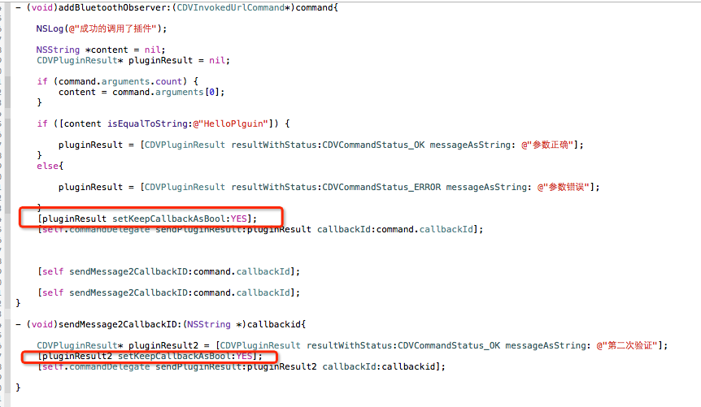

Title: 编写PhoneGapiOS插件三
Date: 2019-09-04 14:27:36

`update: 2015-04-28`

标准插件形式Demo地址：[cordova-plugin-test](https://github.com/yinxianwei/cordova-plugin-test)

> 主要是JS的回调，附Demo地址。

<!-- more -->

#编写插件方法

- html里面调用已经写过了，只是没有对数据进行处理，`CDVInvokedUrlCommand`这个类里有两个重要的参数。
	
	- `arguments`
	
		用于接收JS传过来的参数。
		
	- `callbackId`
	
		用于记录JS回调代码块的ID，主要用它来回调JS代码。

<!--more-->

- 插件判断传过来的第一个参数是否为`HelloPlguin`，是就回调成功函数，反之失败。代码如下：

	

- 运行效果如下：

#重复回调JS函数

- 我想实现多次回调JS代码，于是我就天真的这样写：

		[self.commandDelegate sendPluginResult:pluginResult callbackId:command.callbackId];
   
		[self.commandDelegate sendPluginResult:pluginResult callbackId:command.callbackId];

	发现并不能回调多次，第二次调用时PhoneGap认为记录的这条`callbackId`已经回调成功了，所以就不会继续执行。

- 然后这样写就实现了多次调用：

参考：[phoneGap开发IOS,JS调用IOS方法/phoneGap插件开发](https://my.oschina.net/jgy/blog/175643#OSC_h4_4)

Demo地址：[JEPlguinDemo](https://github.com/yinxianwei/JEPlguinDemo.git)

