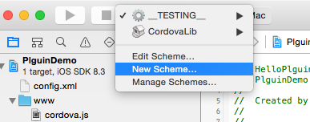
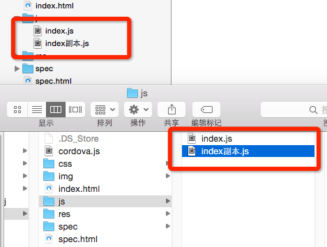
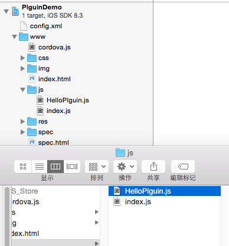
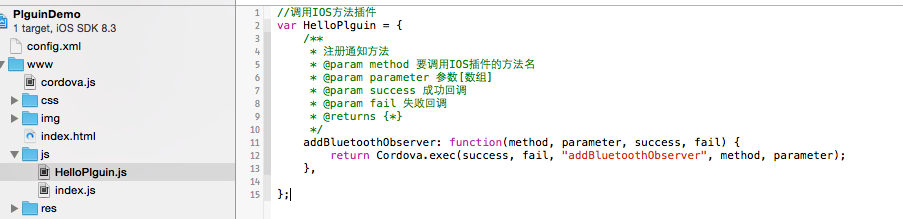
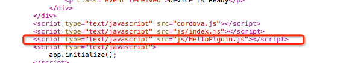
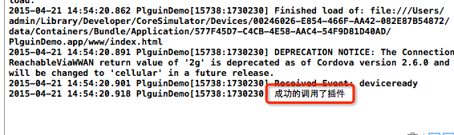

Title: 编写PhoneGapiOS插件二
Date: 2019-09-04 14:27:44

    
> 由于要写关于蓝牙的插件，所以方法名里会包含蓝牙关键字，不要奇怪。

#打开工程

- 打开工程如下：
	

<!-- more -->

#新建Scheme
<!--more-->
打开并没有办法直接运行，需要创建scheme步骤如下：

- Xcode左上角：

- OK

	
- 成功

	
- 运行和终端结果一样就不上图了。

#新建Plguin类

- 新建OC类`HelloPlguin`继承于`CDVPlugin`

- 导入头文件并创建插件方法

	

- 这里我们先不具体实现，只打个Log

#创建JavaScript文件

- 在Finder中查看js文件

- 直接拷贝个已有的`index.js`文件，然后修改文件名为`HelloPlguin.js`

	

- 添加方法

	

#config.xml配置

- 在`config.xml`中添加方法功能
	

#在index.html调用Plguin方法

- 引入js文件
	

	
- 调用
	

	
- 由于方法只打了一个LOG，所以没有回调，运行就可以看到log了
	

	

参考：[phoneGap开发IOS,JS调用IOS方法/phoneGap插件开发](https://my.oschina.net/jgy/blog/175643)

